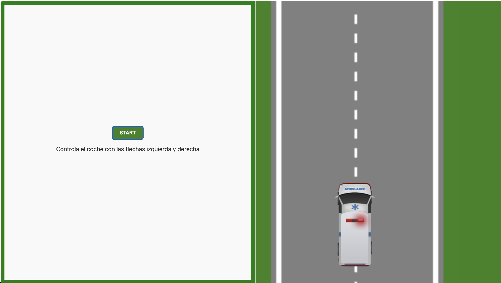
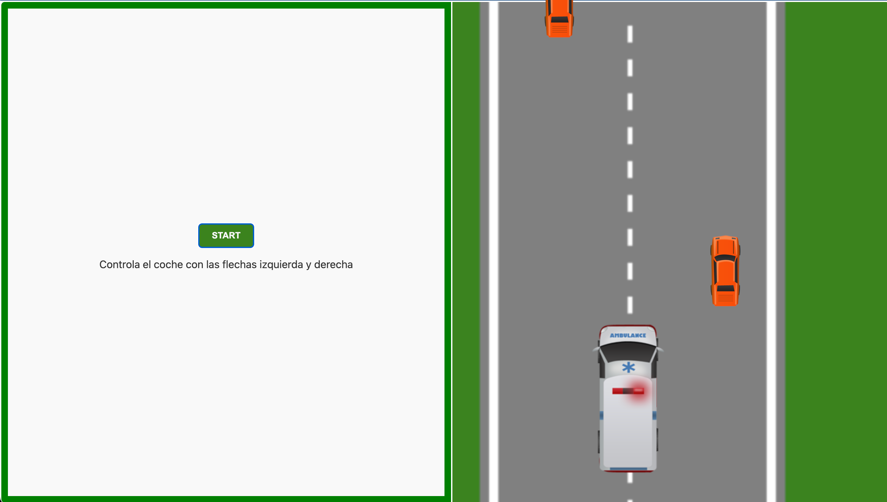

#

## ITERACIÓN 1: Tablero

Lo primero es crear el tablero. El lado izquierdo del viewport ya está en el archivo HTML, pero al ahcer click en el botón 'START', mostraremos la carretera.

Encuentra la imagen de la carretera en `assets` y píntala en el canvas. La imagen debe ocupar todo el ancho y alto del canvas.

## ITERACIÓN 2: Jugador

Es el turno del coche del jugador. En `assets/ambulance.png` está el sprite para dibujar y animar la ambulacia.

## ITERACIÓN 3: Movimiento del jugador

El jugador sólo puede mover el coche hacia la derecha y hacia la izquierda dentro de los límites de la pista. Configura los controles para usar las flechas left y right para mover la ambulacia.

## ITERACIÓN 4: Obstaculos

Ahora debemos crear obstáculos que aparezcan en cada período de tiempo específico.

Estos serán coches, tienes el sprite en `assets/car.png`

Siempre comenzarán en la posición 0 del y-axis pero en un lugar aleatorio en el x-axis.

los obstáculos vendrán desde la parte superior del lienzo hacia abajo. Para adelantar los coches necesitas actualizar el canvas 60 veces por segundo y cambiar la posición de los obstáculos para que avancen.

## ITERACIÓN 5: Colisiones

Detecta si el jugador colisiona con un obtaculo para finalizar la partida.

Al colisionar con algún obstaculo muestra un alert de GAME OVER.

## ITERACIÓN 6: Puntuación

Inventa un sistema de puntuación para contar puntos mientras el coche esquiva obstáculos. Muestra al jugador un letrero en todo momento con el avance de la puntuación.

Añade al alert de GAME OVER la puntuación conseguida (TU PUNTUACIÓN FINAL ES: 56).

Al pulsar el botón START el juego comenzará de nuevo.

